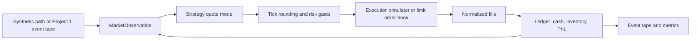

# Architecture and Design Review Notes

## System boundary

The repository is organized as a deterministic market simulator with a market-making research layer above it. The matching engine does not know how a strategy chooses quotes, and a strategy does not mutate cash or inventory. That separation is the main correctness boundary.



## Package layout

```text
src/lob_sim/
  core/                 price-time-priority order book and event models
  data/                 JSON event tape and replay cursor
  data/external_tape.py versioned Project 1 event-tape schema and digest
  agents/               observations, volatility, and quote strategies
  risk/                 shared quote sanitizer and hard risk limits
  synthetic/            seeded exogenous paths and market regimes
  accounting.py         cash, inventory, wealth, and PnL attribution
  simulation.py         deterministic intensity-fill experiment harness
  lob_execution.py      snapshot and persistent synthetic L2 adapters
  external_execution.py optional adapter for Project 1's qr_platform LOB
  analysis/             Monte Carlo summaries and SVG diagnostics
tests/                  unit, property, and integration tests
scripts/                reproducible experiment entry points
docs/                   mathematical model, architecture, and report
```

## Event ordering

One simulation interval follows this sequence:

1. Build an observation from the current market point, causal volatility
   estimate, and available flow features.
2. Pass the observation and an immutable account view to the strategy.
3. Round and risk-gate the raw continuous quote.
4. Sample passive fills during the interval using the configured execution model.
5. Apply fills to the ledger at the current reference price.
6. Advance the exogenous market point and mark inventory to market.
7. Record post-fill adverse selection and append all events to the tape.

This order makes the PnL decomposition inspectable. It also ensures that a strategy cannot use the next price move when choosing its current quote.

### External event-driven mode

When `ExternalLimitOrderBookMarketSimulator` is selected, the interval has a
matching-engine-backed variant:

1. Read the external book snapshot and update causal volatility, signed flow,
   cancellation, queue-depletion, and toxicity features.
2. Compute, round, and risk-gate the strategy quote.
3. Cancel the previous live agent quote and submit the delayed quote as a new
   external limit order, resetting time priority.
4. Process one generated or replayed Project 1 event: limit, market, or cancellation.
5. Convert every trade involving an agent order into a normalized fill and
   apply it to the shared ledger.
6. Mark inventory at the executable bid when long and executable ask when
   short; retain the synthetic reference for adverse-selection diagnostics.

The Project 1 generator can sample any active order for cancellation but does
not carry participant ownership. The adapter therefore neutralizes generated
cancellations aimed at the agent while preserving the event count; external
market and crossing-limit events remain capable of filling agent quotes.
Terminal inventory is liquidated through an external market order first. Any
unfilled residual uses the configured deterministic slippage backstop, and the
residual quantity is reported explicitly.

## Correctness invariants

The core book asserts:

- every live order appears in exactly one price-level queue;
- every live order has positive remaining quantity;
- bid price levels remain strictly below ask price levels;
- price-time queue order is preserved until cancel or replacement;
- a trade consumes the minimum of aggressor and resting remaining quantity;
- trades execute at the resting order's price.

The ledger asserts through tests:

```text
final wealth - initial cash
  = spread capture
    + inventory mark-to-market
    - fees
    + terminal liquidation PnL
```

Adverse selection is retained as a diagnostic cost because it is a useful post-fill label, but it is not subtracted again from the accounting identity. It overlaps with the inventory price path after a fill.

## Determinism and fairness

The market path and execution uniforms are seeded separately. For a given seed, all strategies can receive the same exogenous reference path and aligned bid and ask execution uniforms. This is a common-random-number design: it reduces the variance of strategy differences without pretending that the strategies have identical fills.

The strategy event tape stores observations, actions, fills, adverse-selection labels, liquidation, and the terminal accounting error. The external market tape separately stores the reference path and validated Project 1 event records. Its canonical JSON has a SHA-256 digest and can be compared byte-for-byte after a deterministic rerun.

Experiment manifests store the resolved configuration, strategy parameters,
seed set, Python/platform information, path-independent source digests, and
external-simulator digest. Generated artifacts are excluded from the source
digest so rerunning an experiment does not change the code identity.

## Complexity and performance posture

The current matching engine prioritizes transparent correctness over maximum throughput. Price levels are dictionary-backed and best-price lookup scans the active price keys. Matching within a level is O(1) per consumed queue element; best-price lookup is O(number of active price levels). This is appropriate for the first research layer and makes invariants easy to inspect.

The benchmark now records the current baseline before optimization. The next
performance milestone is to replace price-key scans with heaps and lazy
deletion, then compare throughput and tail latency against this saved baseline.
The public order and trade models do not need to change for that optimization.

## Research limitations

The intensity simulator is intentionally not a market-impact model. Prices are
exogenous, and the snapshot LOB adapter rebuilds background top-of-book depth
from each synthetic point rather than replaying a persistent historical L2
tape. These limitations are explicit so results are interpreted as controlled
strategy comparisons. Persistent event-tape replay, richer queue dynamics, and
impact remain future layers.

The stress runner sweeps volatility and latency across the four strategies and
writes grouped JSON plus per-run CSV outputs. The external adapter supports
persisted replay and a causal toxic-flow treatment, but the tape is still
generated from a synthetic Project 1 order-flow model rather than a historical
exchange feed. Historical calibration, market impact, explicit exchange fees,
separate cancel latency, and exchange-specific ownership rules remain explicit
future work. The current benchmark is a correctness-first baseline; it does
not claim production throughput or tail-latency performance.
